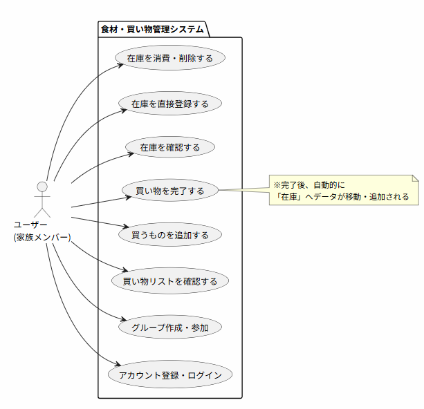

# Fridgexiston
System Design

# 利用
https://tak.pythonanywhere.com/

# Fridgexiston 要求定義書(仕様書)

## 1. システム概要
### 目的
家族（○○家）内で、現在家にある「在庫食材」と、買い出しが必要な「必要な食材」の情報をリアルタイムに共有し、買い忘れや重複購入、食材の無駄をなくす。

### ターゲットユーザー
日常的に料理や買い出しを行う、同じ世帯（グループ）のメンバー。

### 利用想定デバイス
主にスマートフォン（スーパーでの買い物中や、キッチンでの冷蔵庫確認時に使用するため）。

---

## 2. 用語定義
チーム内での認識ズレを防ぐため、システム内で扱う言葉を定義します。

| 用語 | 定義 |
| :--- | :--- |
| **ユーザー** | 本システムを利用する個人。 |
| **グループ（○○家）** | ユーザーが所属する単位。データ（食材リスト）はこのグループ内で共有される。 |
| **家にあるリスト** | 現在、家（冷蔵庫やパントリーなど）にある食材。 |
| **買うリスト** | 今後買う必要がある食材（買い物リスト）。 |

---

## 3. 機能要件（システムができること）
ご提示いただいた「登録できる」という要件を満たすためには、閲覧・更新・削除（CRUD）の機能も必然的に必要となります。

### 3.1 アカウント・グループ管理機能
- **ユーザー登録・ログイン**
  - 4桁パスワードでログインできる。
- **グループの作成**
  - ユーザーは新規に「○○家」というグループを作成できる。
- **グループへの招待・参加**
  - 他のユーザーを「○○家」に招待し、メンバーとして追加できる（招待リンクやQRコードなど）。

### 3.2 在庫食材（ストック）管理機能
- **在庫の登録**
  - 食材名入力し、在庫として登録できる。（今後：数量） 
- **在庫の一覧表示**
  - 現在家にある食材を一覧で確認できる。
- **（在庫の消費・更新・削除）**
  - 使った食材の数を減らしたり、使い切った食材をリストから削除できる。

### 3.3 必要な食材（買い物リスト）管理機能
- **必要な食材の登録**
  - 買いたい食材名と数量を登録できる。
- **必要な食材の一覧表示**
  - 買い物中に見やすいリストとして確認できる。
- **購入完了（状態遷移）**
  - 買い物が完了した食材にチェックを入れると、リストから消え、**自動的に「在庫食材」へ移動（追加）される**。
- **購入時通知**
  - ユーザがリストから削除したら（食材を購入したら）、別のメンバーユーザに通知がいく

---

## 4. 非機能要件（品質や性能など）
- **ユーザビリティ（操作性）**
  - スマートフォンでの片手操作を前提としたUI/UX（例：買い物中に片手でチェックを入れやすいボタン配置）。
- **リアルタイム性・可用性**
  - 家族の誰かが買い物を完了してリストを更新した際、別の家族の画面にも可能な限りタイムラグなく反映されること（重複購入を防ぐため）。

---

## 5. チームで次に議論・決定すべき事項（オープンクエスチョン）
この要求仕様をさらに固めるために、以下の点についてチームで話し合うことをおすすめします。

1. **食材の属性はどこまで持たせるか？**
   - 「賞味期限」や「保存場所（冷蔵・冷凍・常温）」、「カテゴリ（肉・野菜・日用品）」などの入力項目は必要か？（項目が多すぎると入力が面倒になり、使われなくなるリスクがあります）
2. **履歴は必要か？**
   - 「誰が・いつ・何を買ったか」の履歴を残す必要があるか？
3. **認証の仕組みはどうするか？**
   - 家族で手軽に使い始めるために、最初は簡易的な認証（共有パスワードのみ等）にするか、しっかり個別アカウントを作るか？

# ユースケース定義書

## 1. アクター（システムを利用・操作する主体）
- **ユーザー（家族のメンバー）：** スマートフォンからアプリを操作し、在庫や買い物リストの確認・更新を行う。

---

## 2. ユースケース一覧
ユーザーがシステムに対して行える具体的なアクション（ユースケース）のリストです。

### 認証・グループ管理
- アカウントを登録・ログインする
- 新規グループ（○○家）を作成する
- 既存グループに招待URL等から参加する

### 買い物リスト管理（買う前〜買い物中）
- 必要な食材（買い物リスト）の一覧を確認する
- 必要な食材を新規登録する
- **買い物が完了した食材にチェックを入れる（★コア機能）**
- 間違えて登録した食材をリストから削除・編集する

### 在庫（ストック）管理（買った後〜消費）
- 家にある在庫食材の一覧を確認する
- 家にある在庫を直接登録する（もらい物など）
- 使った食材の在庫数を減らす / 削除する

---

## 3. ユースケース図（PlantUML）

---

## 4. ユースケース記述（詳細シナリオ）
開発を進める上で、裏側（システム側）の動きを含めて認識を合わせる必要がある「買い物を完了する（★コア機能）」について、詳細なシナリオを記述します。

| 項目 | 内容 |
| :--- | :--- |
| **ユースケース名** | **買い物を完了する** |
| **アクター** | ユーザー |
| **事前の条件** | ユーザーがログインしており、特定のグループに所属している。 買い物リストに1つ以上の食材が登録されている。 |
| **事後の条件** | 対象の食材が買い物リストから削除され、在庫リストに追加（または加算）されている。 |
| **メインフロー （基本の動き）** | 1. ユーザーは「買い物リスト画面」を開く。 2. ユーザーは購入した食材の「完了」ボタン（またはチェックボックス）をタップする。 3. システムは、タップされた食材を「買い物リストデータ」から削除する。 4. システムは、同グループの「在庫リストデータ」に該当食材を追加する。  *(※既に同じ名前の食材が在庫にある場合は、数量を加算する)* 5. システムは画面を更新し、ユーザーに購入完了（在庫への移動）を視覚的に伝える。 |
| **代替フロー （例外的な動き）** | **2a. ネットワークエラーが発生した場合：**  - システムは「通信に失敗しました」とエラーメッセージを表示し、チェック状態を元に戻す。 **4a. 在庫の最大登録数や文字数制限等の上限に達した場合：**  - システムは「在庫に追加できませんでした」と警告を出し、買い物リストからの削除も取り消す（ロールバック）。 |
