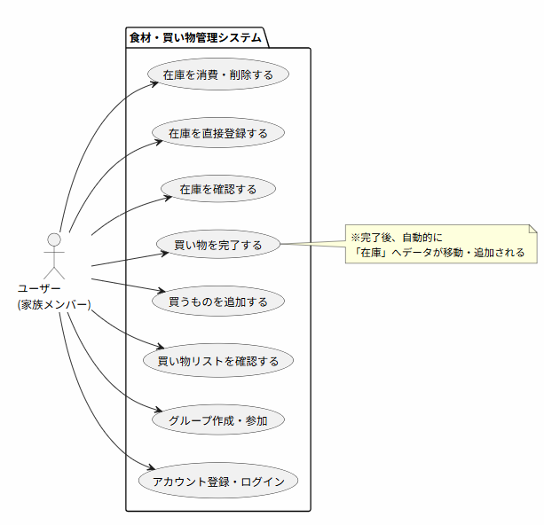

# ユースケース定義書

## 1. アクター（システムを利用・操作する主体）
- **ユーザー（家族のメンバー）：** スマートフォンからアプリを操作し、在庫や買い物リストの確認・更新を行う。

---

## 2. ユースケース一覧
ユーザーがシステムに対して行える具体的なアクション（ユースケース）のリストです。

### 認証・グループ管理
- アカウントを登録・ログインする
- 新規グループ（○○家）を作成する
- 既存グループに招待URL等から参加する

### 買い物リスト管理（買う前〜買い物中）
- 必要な食材（買い物リスト）の一覧を確認する
- 必要な食材を新規登録する
- **買い物が完了した食材にチェックを入れる（★コア機能）**
- 間違えて登録した食材をリストから削除・編集する

### 在庫（ストック）管理（買った後〜消費）
- 家にある在庫食材の一覧を確認する
- 家にある在庫を直接登録する（もらい物など）
- 使った食材の在庫数を減らす / 削除する

---

## 3. ユースケース図（PlantUML）

---

## 4. ユースケース記述（詳細シナリオ）
開発を進める上で、裏側（システム側）の動きを含めて認識を合わせる必要がある**「買い物を完了する（★コア機能）」**について、詳細なシナリオを記述します。

| 項目 | 内容 |
| :--- | :--- |
| **ユースケース名** | **買い物を完了する** |
| **アクター** | ユーザー |
| **事前の条件** | ユーザーがログインしており、特定のグループに所属している。 買い物リストに1つ以上の食材が登録されている。 |
| **事後の条件** | 対象の食材が買い物リストから削除され、在庫リストに追加（または加算）されている。 |
| **メインフロー （基本の動き）** | 1. ユーザーは「買い物リスト画面」を開く。 2. ユーザーは購入した食材の「完了」ボタン（またはチェックボックス）をタップする。 3. システムは、タップされた食材を「買い物リストデータ」から削除する。 4. システムは、同グループの「在庫リストデータ」に該当食材を追加する。  *(※既に同じ名前の食材が在庫にある場合は、数量を加算する)* 5. システムは画面を更新し、ユーザーに購入完了（在庫への移動）を視覚的に伝える。 |
| **代替フロー （例外的な動き）** | **2a. ネットワークエラーが発生した場合：**  - システムは「通信に失敗しました」とエラーメッセージを表示し、チェック状態を元に戻す。 **4a. 在庫の最大登録数や文字数制限等の上限に達した場合：**  - システムは「在庫に追加できませんでした」と警告を出し、買い物リストからの削除も取り消す（ロールバック）。 |